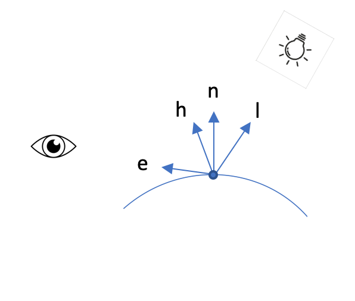

# Assignment 5 (Art Render) Worksheet

## Q1: Phong Shading

Given the following lighting equation:

*diffuse* = *n* &middot; *l*

*specular* = (*n* &middot; *h*) ^ *s*

*color* = ka\*Ia + kd\*Id\**diffuse* + ks\*Is\**specular*

Draw a picture that includes a point on a surface, a light, and labeled arrows
for each vector that shows up in the equation. Hint: make sure that your
vectors point in the right direction to make sense for the equation as written
(e.g., make sure you draw *l* pointing in the correct direction for *n*
&middot; *l* to be calculated correctly)!

Replace this image with your diagram:




## Q2: Silhouette Outline

This week in class we'll be talking in more detail about the key matrices used
in vertex and fragment shaders. For example, we'll learn that the
`normal_matrix` must be used rather than the `model_view` matrix to transform
normals to eye (a.k.a. camera) space. You'll use this in all of the shaders
you write. The outline shader includes the most interesting use of normals
though because not only does each vertex have a normal, the shader also has
access to the "left normal" for the normal of the triangle to the left and the
"right normal" for the triangle to the right. As you see in the assignment
handout these are used to determine whether the vertex lies on a silhouette
edge. Here are a few questions about the logic you'll need to use in that
shader:

### Q2.1
Your outline vertex shader will need to include an if statement that is true
if the vertex lies on a silhouette edge by testing the left normal and right
normal in some way. Assuming `vec3 e` is a vector calculated in eye space
that points from the vertex to the eye and `vec3 nl` is defined for the left
normal and `vec3 nr` for the right normal, fill in the condition on the if
statement:

```
if (dot(e, nl) * dot(e,nr) < 0.0)
```

### Q2.2
For the `nl` and `nr` that appear in your if statement above, should these two
vectors be transformed to eye space using the `normal_matrix`?

```
/* --- Write your answer here (yes / no) --- */
yes
```

### Q2.3
If your if statement is `true` you will then need to offset the vertex in the
direction of the normal to move it outwards in order to create the "fin" that
forms the silhouette outline. Should this normal vector be transformed to eye
space using the `normal_matrix`?

```
/* --- Write your answer here (yes / no) --- */
no
```
